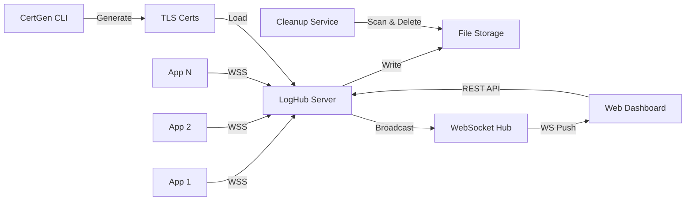

# LogHub — 应用日志集中管理平台

> 一站式多应用日志采集、存储与实时监控解决方案。通过 WSS 安全通道统一收集分布式应用日志，支持按应用/日期分层存储、过期自动清理、历史检索与实时流式查看。

---

## 系统架构



| 模块 | 职责 |
|:-----|:-----|
| WSS Server | 接收各应用通过 WebSocket Secure 推送的日志数据 |
| Log Store | 按 应用ID/日期.log 分层写入文件系统 |
| Cleanup Service | 定时扫描并删除超过保留天数的日志文件 |
| REST API | 提供日志查询、应用列表、仪表盘统计等接口 |
| WebSocket Hub | 实时广播日志到前端查看器 |
| CertGen CLI | 命令行工具生成自签名 TLS 证书 |
| Web Dashboard | 现代化前端界面支持历史日志检索与实时日志流 |

---

## 技术栈

- **Frontend**: React 18 + Tailwind CSS + Vite + Lucide Icons
- **Backend**: Go 1.21 (gorilla/websocket + zap + yaml.v3)
- **Database**: 无数据库依赖，日志直接写入文件系统（Docker Volume 持久化）
- **Infra**: Docker + Nginx

---

## 实时日志快速测试

系统启动后，可通过 `wscat` 交互式测试实时日志推送：

```bash
npx wscat -c wss://localhost:8443/ws/producer?app_id=app-web-frontend --no-check
```

连接成功后会看到类似输出：

```
Connected (press CTRL+C to quit)
< {"type":"connected","code":200,"message":"connected to LogHub","data":{...}}
>
```

> 这条 `{"type":"connected"...}` 是服务器给 Producer 的握手确认，不是日志消息，前端不会显示。

在 `>` 提示符后粘贴以下 JSON 并按回车，即可发送一条日志：

```json
{"type":"log","payload":{"level":"INFO","message":"实时日志测试 - Hello LogHub!","source":"test"}}
```

可反复粘贴发送多条，`Ctrl+C` 退出。

**验证**：打开 http://localhost:3000 → 登录 → 进入 Web前端应用 → 切换到「实时日志」标签页，即可看到推送的日志实时出现。

---

## 快速启动 (Docker)

1. 确保 Docker Desktop 已运行
2. 在项目同级目录执行：`docker build -t loghub-3337 .`
3. 启动容器：`docker run --rm -p 3000:3000 -p 8000:8000 -p 8443:8443 loghub-3337`
4. 等待日志出现 `HTTP server starting` 和 `Starting Nginx frontend on port 3000`
5. 访问前端：http://localhost:3000
6. 后端 API：http://localhost:8000
7. WSS 端口：wss://localhost:8443

---

## 服务地址

| 服务 | 地址 | 说明 |
|:-----|:-----|:-----|
| Frontend | http://localhost:3000 | Web 管理界面 |
| Backend API | http://localhost:8000 | REST API |
| WSS Server | wss://localhost:8443 | 日志推送安全通道 |

---

## 测试账号

- **用户名**: admin
- **密码**: 123456

---

## 核心功能

### 1. 登录认证
现代化登录界面，JWT Token 鉴权（24小时有效），未登录自动跳转登录页。

### 2. 控制面板
实时展示注册应用数、在线应用数、日志文件数、存储占用。应用卡片展示在线状态，点击直达日志查看器，30秒自动刷新。

### 3. 历史日志查看
左侧文件列表按日期排列显示文件大小。支持关键词搜索、日志级别过滤（DEBUG/INFO/WARN/ERROR/FATAL），分页浏览每页100条，日志行号与级别徽标。

### 4. 实时日志流
WebSocket 实时推送终端风格暗色主题。支持暂停/继续、自动滚动、清空操作。连接状态实时指示。

### 5. WSS 安全日志采集
自定义 TLS 证书（ECDSA P-256），容器启动时自动生成证书。支持单条和批量日志推送，应用ID白名单校验。

### 6. 证书命令行生成
```bash
./certgen -out ./certs -org "MyOrg" -cn "LogServer" -days 365 -hosts "localhost,192.168.1.100"
```
参数说明：-out 输出目录，-org 组织名，-cn 通用名，-days 有效天数，-hosts 主机名/IP列表。

### 7. 日志自动清理
配置文件设定最大保留天数（默认30天），定时扫描过期日志并自动删除，清理间隔可配置（默认60分钟）。

### 8. 系统配置查看
查看 WSS 端口、保留天数等配置，已注册应用列表，接入示例代码。

---

## 日志接入示例

```javascript
// JavaScript / Node.js
const ws = new WebSocket('wss://your-host:8443/ws/producer?app_id=app-web-frontend');
ws.onopen = () => {
  ws.send(JSON.stringify({
    type: 'log',
    payload: { level: 'INFO', message: '应用启动成功', source: 'main' }
  }));
};

// 批量发送
ws.send(JSON.stringify({
  type: 'batch_log',
  payload: [
    { level: 'INFO', message: '日志1', source: 'main' },
    { level: 'WARN', message: '日志2', source: 'main' }
  ]
}));
```

---

## 项目结构

```
item3337/
├── README.md
├── frontend/
│   ├── nginx.conf
│   ├── package.json
│   ├── src/
│   │   ├── App.jsx              # 路由配置
│   │   ├── components/          # 公共组件(Layout/Toast/Modal)
│   │   ├── pages/               # 页面(Login/Dashboard/LogViewer/Settings)
│   │   └── utils/               # 工具(api.js/websocket.js)
├── backend/
│   ├── entrypoint.sh
│   ├── main.go                  # 主入口
│   ├── config.yaml              # 应用配置
│   ├── config/config.go         # 配置管理
│   ├── model/model.go           # 数据模型
│   ├── handler/api.go           # REST API
│   ├── handler/ws.go            # WebSocket
│   ├── middleware/middleware.go  # 中间件
│   ├── service/logstore.go      # 日志存储
│   ├── service/cleanup.go       # 过期清理
│   ├── service/seeddata.go      # 演示数据
│   └── cmd/certgen/main.go      # 证书生成CLI
```

---

## 专业工程实践

### 1. 日志系统
使用 go.uber.org/zap 结构化日志，JSON 格式输出到 stdout/stderr，包含时间戳、级别、调用者信息。通过 `docker compose logs` 可查看清晰的运行日志。

### 2. 错误处理
- 后端统一 `{code, message, data}` 响应格式
- 前端 Axios 拦截器统一处理，2秒消息去重防止重复弹窗
- panic 恢复中间件防止服务崩溃
- 业务错误标记 `_isBusinessError` 避免二次提示

### 3. 数据校验
- 配置文件加载时完整校验（端口范围、必填字段、应用ID去重）
- API 参数校验（日期格式、必填参数、分页范围限制）
- WebSocket 消息格式校验，非法消息返回错误响应

### 4. 接口设计
- RESTful API 设计，GET 查询 / POST 操作
- JWT Token 认证，公开接口与保护接口分离
- WebSocket 双通道：producer（日志推送）+ viewer（实时查看）
- CORS 跨域支持，请求日志中间件

### 5. 生产级特性

| 维度 | 状态 | 说明 |
|:-----|:-----|:-----|
| 模块化 | ✅ | config/model/handler/service/middleware 清晰分层 |
| 持久化 | ✅ | Docker Volume 保证日志数据重启不丢失 |
| 安全性 | ✅ | WSS 加密传输 + JWT 鉴权 + 应用白名单 |
| 可配置 | ✅ | YAML 配置文件管理应用、保留天数、端口等 |
| 自动化 | ✅ | 容器启动自动生成证书、填充演示数据 |
| 可观测 | ✅ | 结构化日志 + 仪表盘统计 + 在线状态监控 |
| 优雅关闭 | ✅ | 信号捕获，清理服务有序停止 |
| 容错性 | ✅ | panic 恢复、WebSocket 断线重连、消息去重 |

---

## 配置说明

配置文件位于 `backend/config.yaml`，支持以下配置项：

```yaml
server:
  http_port: 8000          # HTTP API 端口
  wss_port: 8443           # WSS 安全端口
  cert_file: "./certs/server.crt"
  key_file: "./certs/server.key"

log:
  base_dir: "./data/logs"  # 日志存储根目录
  max_retain_days: 30      # 日志最大保留天数
  clean_interval_minutes: 60  # 清理检查间隔(分钟)

auth:
  username: admin
  password: "123456"

apps:                      # 允许接入的应用列表
  - id: "app-web-frontend"
    name: "Web前端应用"
    description: "主站前端应用日志"
```

---

## Docker 镜像源配置

```yaml
# docker-compose.yml 使用的镜像
services:
  backend:
    build: ./backend       # golang:1.21-alpine (构建) + alpine:3.19 (运行)
  frontend:
    build: ./frontend      # node:20-alpine (构建) + nginx:alpine (运行)
```

前端 Dockerfile 已配置淘宝 npm 镜像源加速构建：
```dockerfile
RUN npm config set registry https://registry.npmmirror.com
RUN npm ci
```
